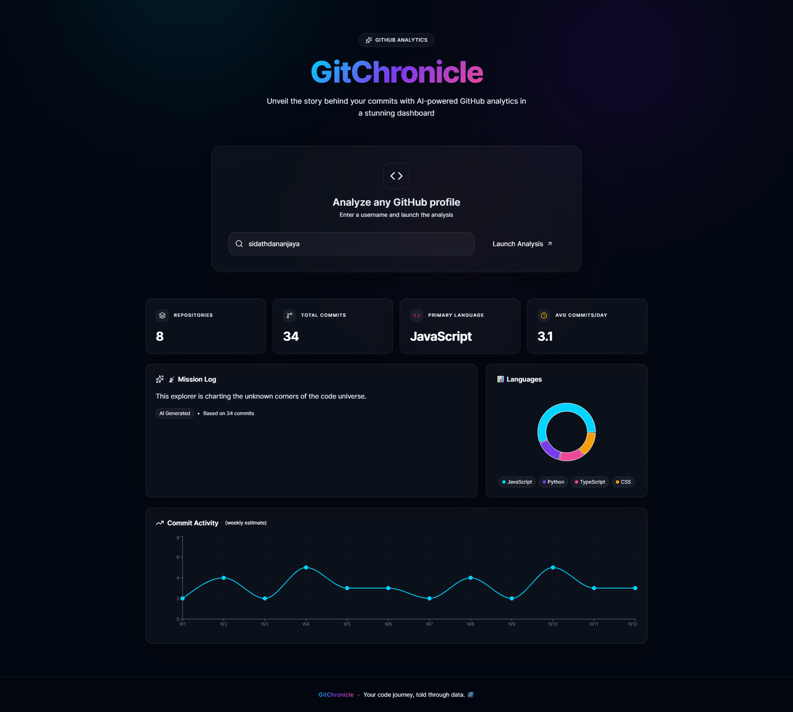
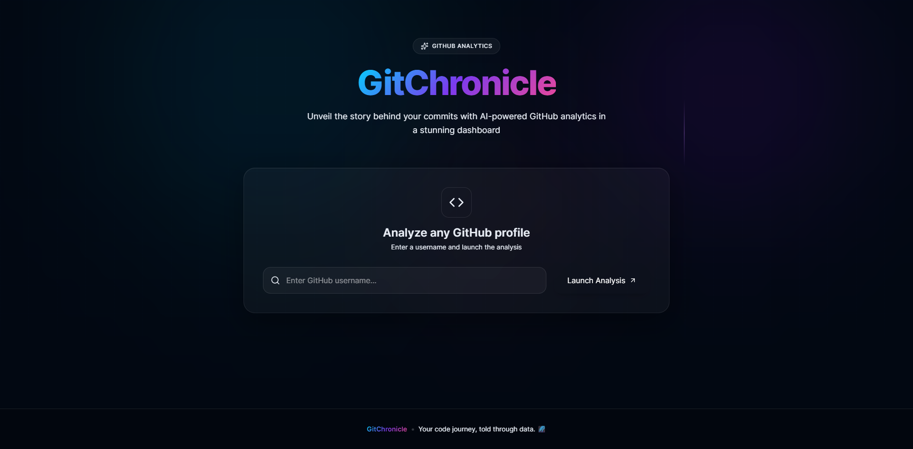

# 🌌 GitChronicle

**Unveil the story behind your commits.**

GitChronicle is a full-stack SaaS dashboard that analyzes any GitHub profile, extracts key metrics, and generates an AI-powered narrative of the developer's journey. Built with a futuristic dark theme, glass-morphism UI, and interactive charts.

🔗 **Live Demo**: [https://gitchronicle-5e22.vercel.app/](https://gitchronicle-5e22.vercel.app/)


  
  
---

## ✨ Features

- **GitHub Analytics**: Fetches repositories, commit counts, primary languages, and average commits per day.
- **AI Narrative**: Uses Google Gemini to write a unique "Mission Log" based on commit messages.
- **Interactive Charts**:
  - 📊 **Language Constellation** - Donut chart showing language distribution.
  - 📈 **Commit Activity** - Weekly trend line chart.
- **Luxury UI**: Glass-morphism cards, bento grid layout, floating glow animations, and responsive design.
- **Dark Theme**: Optimized for readability with a cosmic navy/charcoal palette.

---

## 🛠️ Tech Stack

| **Frontend**     | **Backend**       | **Tools**     |
| :--------------- | :---------------- | :------------ |
| React 19         | Node.js + Express | Vite          |
| Tailwind CSS V4  | Axios             | Framer Motion |
| Recharts         | Google Gemini API | Lucide Icons  |
| Vercel (Hosting) | Render (Hosting)  | GitHub        |

---

## 🚀 Live Demo

Experience the full functionality here:  
👉 **[https://gitchronicle-5e22.vercel.app/](https://gitchronicle-5e22.vercel.app/)**

Just enter a GitHub username (e.g., `SidathDananjaya`) and watch the magic happen.

---

## 🖼️ Screenshots


_The centered search workspace with glassmorphism._


_Bento grid showing stats, AI narrative, and charts._

---

## 💻 Local Setup Instructions

Follow these steps to run GitChronicle on your local machine.

### Prerequisites

- Node.js (v18 or higher)
- npm or yarn
- A GitHub Personal Access Token ([Generate here](https://github.com/settings/tokens))
- Google Gemini API Key ([Get here](https://aistudio.google.com/apikey))

### 1. Clone the Repository

```bash
git clone https://github.com/SidathDananjaya/gitchronicle.git
cd gitchronicle
```

### 2. Backend Setup

```bash
cd server
npm install
```

#### Create a .env file in the server/ folder:

```env
GITHUB_TOKEN=your_github_personal_access_token
GEMINI_API_KEY=your_google_gemini_api_key
```

#### Start the backend:

```bash
npm start
``` 

The server will run on http://localhost:5000.


### 3. Frontend Setup

#### Open a new terminal and navigate to the frontend:

```bash
cd client
npm install
```

#### Create a .env file in the client/ folder:

```env
VITE_API_URL=http://localhost:5000
```

#### Start the frontend:

```bash
npm run dev
```

The app will open on http://localhost:5173.

### 4. Usage

#### Enter a GitHub username in the search bar.

#### Click "Launch Analysis".

#### View your commit stats, language breakdown, and AI-generated story.
---

### 📁 Project Structure

```
gitchronicle/
├── client/ # React + Vite Frontend
│ ├── src/
│ │ ├── App.jsx # Main dashboard component
│ │ └── index.css # Tailwind V4 & custom styles
│ └── package.json
├── server/ # Node.js + Express Backend
│ ├── index.js # API routes & GitHub/Gemini logic
│ └── package.json
└── README.md
```
---

### 🤝 Contributing

This is a personal portfolio project, but feel free to fork it and experiment!

1. Fork the repo

2. Create your feature branch (git checkout -b feature/amazing-idea)

3. Commit your changes (git commit -m 'feat: add amazing idea')

4. Push to the branch (git push origin feature/amazing-idea)

5. Open a Pull Request

---

### 📄 License

This project is open source and available under the MIT License.

### 🙏 Acknowledgements

- [GitHub API](https://docs.github.com/en/rest) for providing the data. 

- [Google Gemini](https://ai.google.dev/) for the AI narrative generation. 

- [Tailwind CSS](https://tailwindcss.com/) for design inspiration.

- Inspired by modern SaaS platforms like [Senthora](https://senthora.ai/) and [Bevel](https://www.bevel.health/).

---

# Made with ❤️ by Sidath Dananjaya
